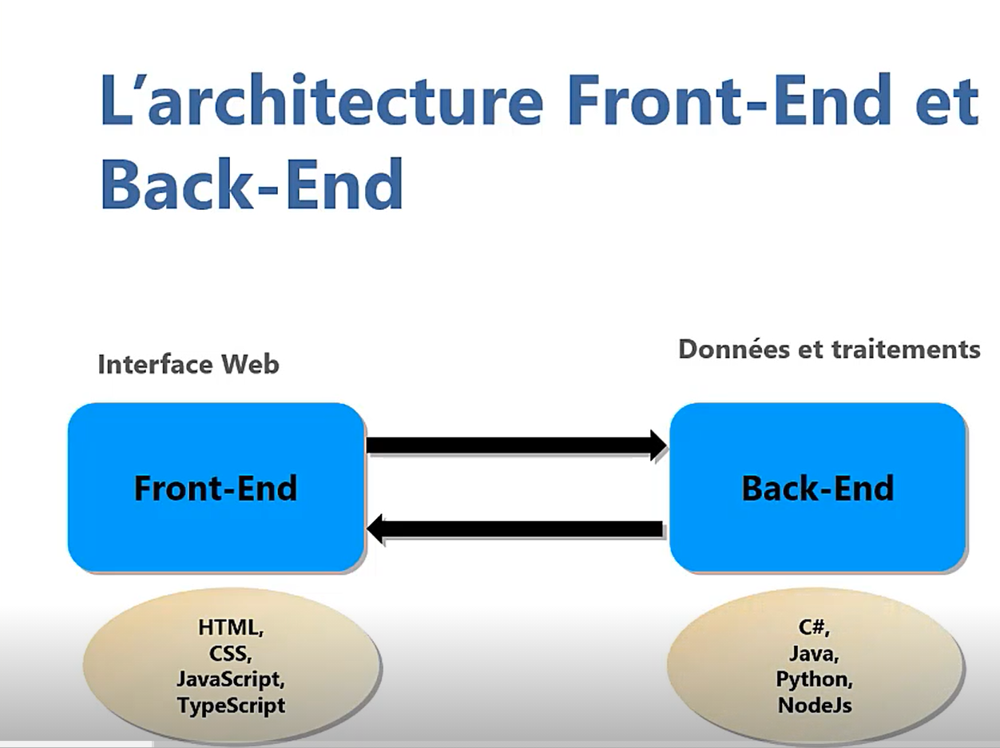
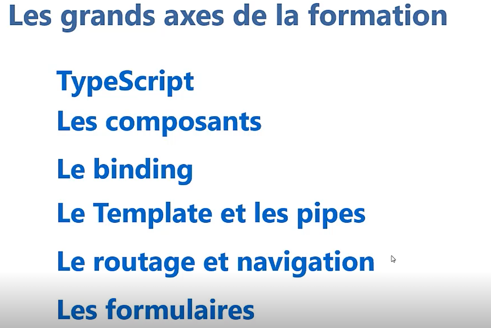
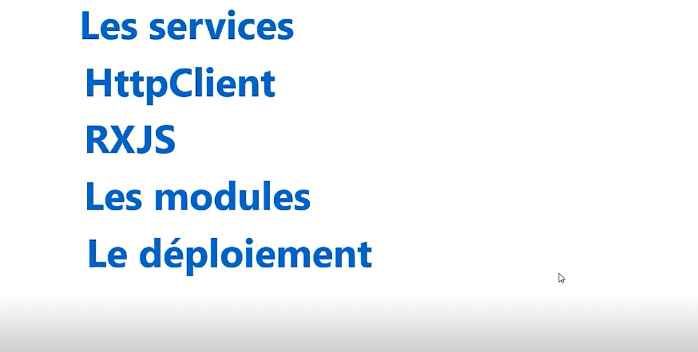
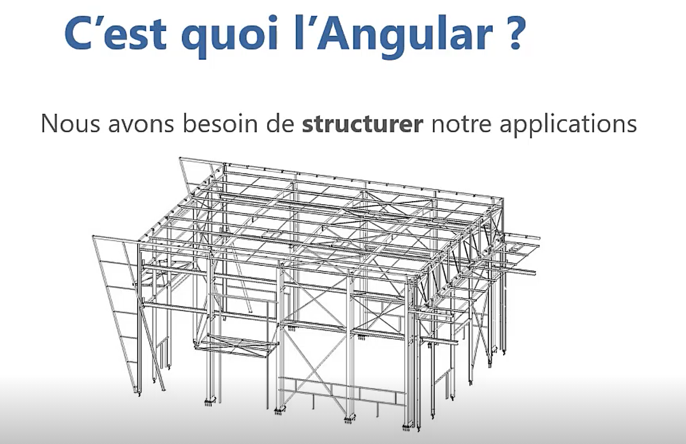
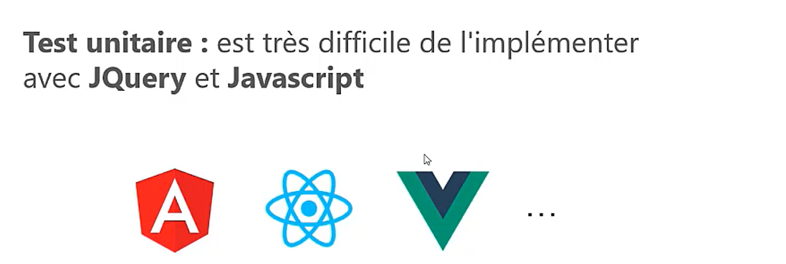
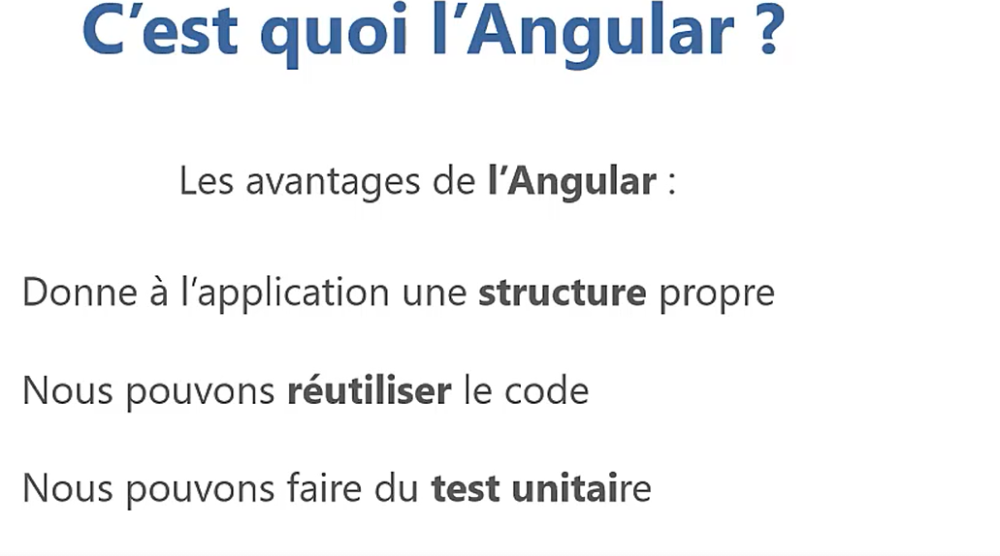

# Essentiel de Angular 11

## Description de la formation
Dans cette **formation Angular 11**, vous allezmaîtriser les bases fondamentales d'**Angular 11** et vous allez apprendre à développer des applications web **SPA (Single Page Application)** robustes de A à Z.

## Angular – Une plateforme de Google pour créer des applications Web

Le **Framework Angular** est une plateforme de création d'applications Web client (Mobile et Desktop) d'une seule page appelé **SPA (Single Page Application)** à l'aide du HTML et du TypeScript.

**Angular** implémente les fonctionnalités de base et facultatives sous la forme d'un ensemble de bibliothèques TypeScript que vous importez dans vos applications web.

**Angular** aide à créer des **applications à page unique (SPA) **interactives et dynamiques avec ses fonctionnalités effectives, notamment la création de modèles, la liaison bidirectionnelle, la modularisation, la gestion des API RESTful, l'injection de dépendances et la gestion AJAX.

## La formation Angular11 – Les bases essentielles
Tout d'abord, vous allez comprendre c'est quoi Angular, son architecture Frontend et Backend et vous allez préparer l'environnement de développement pour commencer avec votre première application en **Angular**, la structure de ce projet, en plus d'un premier contact avec le **Webpack**.

Ensuite, vous allez apprendre les notions essentielles du **langage TypeScript**, notamment comment déclarer les variables en **TypeScript**, les types, l'arrow function, l'héritage en et les interfaces et polymorphisme.

Vous allez aussi explorer et comprendre les composants en Angular, c'est quoi un **composant Angular** et comment le créer avec **Agular CLI**, la notion de **modules en Angular** et vous allez commencer avec la **structure Single Page Application (SPA)** sous **Angular 11**. Également, vous allez voir les notions avancées des **composants Angular**, notamment le cycle de vie d'un composant et les interfaces. Aussi, vous allez appréhender et découvrir la communication entre les composants **Angular** a l'aide d'une démo pratique.

Après, vous allez voir et comprendre les Templates, les directives, le binding et les pipes en **Angular**. Vous allez apprendre à utiliser un composant comme directive, voir les **directives Angular ngIf, ngFor, ngClass et ngStyle**. Vous allez aussi voir le concept de **Binding Angular**, ainsi que les **pipes** et leurs créations sous **Angular11**

Vous allez également voir le **routage**, la **navigation**, les **services**, **HttpClient et RXJS en Angular**. Vous allez comprendre c'est quoi le **routage et navigation sous Angular**,les **paramètres et la sécurité** dans le **routage sous Angular 11**. Vous allez aussi voir c'est quoi un **service** en Angular et le **HttpClientet RXJS**.

A l’issue de cette **formation Angular11** , vous aurez maitriser les fondamentaux de base et essentiels pour la création de d’application web sous Angular 11. Vous aurez aussi acquis les reflexes et les bonnes pratiques a adopter dans vos projets, ce qui vous permettra par la suite de monter en compétence et en performance dans votre carrière professionnelle.
## Architecture Angular 11

## Les axes

## C'est l'Angular

## Les avantage d'Angular

